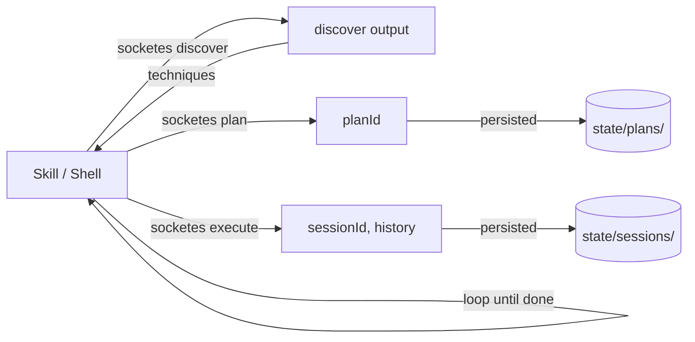

# socketes — User Guide

A single-turn command-line interface to the Creative Thinking three-tool workflow:
`discover_techniques`, `plan_thinking_session`, `execute_thinking_step`. Each invocation does
exactly one operation and exits. Sessions persist on the local filesystem so a multi-step thinking
session can span days across many invocations driven by a skill, a shell script, or a human at the
keyboard.

This document is the human-facing operating manual. For developer-level architecture notes, see
[`CLAUDE.md`](./CLAUDE.md).

## Contents

1. [What socketes is and when to use it](#what-socketes-is-and-when-to-use-it)
2. [Prerequisites](#prerequisites)
3. [Install](#install)
4. [Verify the install](#verify-the-install)
5. [60-second tour](#60-second-tour)
6. [Mental model](#mental-model)
7. [Subcommand reference](#subcommand-reference)
   - [`socketes discover`](#socketes-discover)
   - [`socketes plan`](#socketes-plan)
   - [`socketes execute`](#socketes-execute)
   - [`socketes session`](#socketes-session)
8. [State on disk](#state-on-disk)
9. [Flags vs JSON-on-stdin](#flags-vs-json-on-stdin)
10. [Output contract and exit codes](#output-contract-and-exit-codes)
11. [Parallel execution](#parallel-execution)
12. [Personas and debate mode](#personas-and-debate-mode)
13. [Configuration via environment variables](#configuration-via-environment-variables)
14. [Driving socketes from a Claude Code skill](#driving-socketes-from-a-claude-code-skill)
15. [Gotchas](#gotchas)
16. [Troubleshooting](#troubleshooting)
17. [Using the MCP server bin instead](#using-the-mcp-server-bin-instead)
18. [Uninstall and cleanup](#uninstall-and-cleanup)

---

## What socketes is and when to use it

The `creative-thinking` package exposes **two binaries with different shapes**:

| Binary              | Shape                                                                      | When to reach for it                                                             |
| ------------------- | -------------------------------------------------------------------------- | -------------------------------------------------------------------------------- |
| `socketes`          | Short-lived CLI. One subcommand per invocation, then exits. State on disk. | Skills, shell scripts, ad-hoc terminal use, anywhere subprocess fan-out is easy. |
| `creative-thinking` | Long-running stdio MCP server. Speaks JSON-RPC over stdin/stdout.          | Clients that already speak MCP (Claude Desktop, Cursor, etc.).                   |

Both binaries dispatch through the same in-process handlers; the contract (three tools, 28
techniques, 8 built-in personas, debate mode, etc.) is identical. The CLI exists because
skill-driven flows where the model is the orchestrator are easier to build against short-lived
processes than against a long-running server.

If you don't already have an MCP client open and you want to drive structured thinking from a skill
or terminal, use `socketes`. Otherwise, the `creative-thinking` MCP server may fit better.

## Prerequisites

For the npm-based install paths (A, B, C):

- **Node.js 18+** (the build targets ES2022; older Node versions will fail at module load). Check
  with `node --version`.
- **Git** if you intend to install from GitHub (the package is not currently on the npm registry, so
  npm pulls source via Git).

For the standalone binary install path (D):

- **Nothing.** No Node, no git, no npm. Just `chmod +x` and run.

For all paths:

- **Disk space** under `PERSISTENCE_PATH` (default `~/.creative-thinking`). Sessions are small (a
  few KB each); plans can run from a few KB to ~30 KB for multi-technique workflows.

No databases, no daemons, no network. socketes is purely local.

## Install

Four install paths, in increasing order of "permanence on your machine": A. one-shot `npx`, B.
global `npm install`, C. local clone, D. standalone single-file binary.

### A. Run from GitHub via npx (no install)

The fastest way to try the CLI. `npx` clones the repo's checked-in build and runs it.

```bash
npx -y -p github:uddhav/creative-thinking socketes --help
```

The `-p` (`--package`) flag is **required** because the package's default bin is `creative-thinking`
(the MCP server), not `socketes`. Plain `npx -y github:uddhav/creative-thinking` starts the MCP
server on stdio and waits for JSON-RPC — not what you want for the CLI.

### B. Global install — both bins on `PATH`

```bash
npm install -g github:uddhav/creative-thinking
socketes --help
creative-thinking          # if you also want the MCP server bin
```

After this, `socketes` and `creative-thinking` are available like any other shell command.

To upgrade later:

```bash
npm install -g github:uddhav/creative-thinking@latest
```

`@latest` re-pulls the default branch.

### C. Local clone for development

```bash
git clone https://github.com/uddhav/creative-thinking.git
cd creative-thinking
npm install
npm run build
node dist/cli.js --help
```

The build script compiles TypeScript to `dist/` and chmods both `dist/cli.js` and
`dist/mcp-server-main.js` to `0755`. The repo intentionally checks in `dist/` so `npx`-from-GitHub
works without a build step on the consumer side.

### D. Installing the standalone binary

For machines without Node.js or git, prebuilt single-file binaries are attached to each GitHub
Release at <https://github.com/uddhav/creative-thinking/releases>. No Node, no npm, no dependencies
— one ~60 MB file.

```bash
# Pick the asset that matches your platform
TAG=$(gh release list -R uddhav/creative-thinking -L 1 --json tagName -q '.[0].tagName')
gh release download "$TAG" -R uddhav/creative-thinking \
  -p "socketes-darwin-arm64" -p "SHA256SUMS"

# Verify the checksum before running anything
shasum -a 256 -c SHA256SUMS --ignore-missing

# Install
chmod +x socketes-darwin-arm64
sudo mv socketes-darwin-arm64 /usr/local/bin/socketes
socketes --version
```

Available targets: `socketes-darwin-arm64`, `socketes-darwin-x64`, `socketes-linux-arm64`,
`socketes-linux-x64`. Each binary is built by Bun's `--compile` mode from the same source as the
npm-distributed CLI.

#### macOS Gatekeeper

The binaries are **not code-signed or notarized**, so the first time you run one you'll see:

```
"socketes-darwin-arm64" cannot be opened because the developer cannot be verified.
```

Two ways through it:

```bash
# Option 1 — strip the quarantine attribute (one command, persistent)
xattr -d com.apple.quarantine /usr/local/bin/socketes

# Option 2 — right-click in Finder, choose Open, confirm the dialog (one-time)
```

After that the binary runs unattended. If the `creative-thinking` GitHub repository ever publishes
signed releases, the quarantine step won't be needed.

#### Why a 60 MB binary?

Each binary embeds Bun's runtime (~50 MB) plus the bundled CLI source (~10 MB). The CLI itself is
small; the runtime is the floor. Trade-off: zero-prereq install vs. larger download. If you want the
small footprint, use the npm install path (B) instead — it shares your already-installed Node.js.

## Verify the install

```bash
socketes --version       # prints the version from package.json (e.g. 0.6.1)
socketes --help          # lists subcommands
socketes discover --problem "test"
```

If `socketes discover` returns a JSON document on stdout with a `recommendations` array, the install
is healthy.

## 60-second tour

A complete discover → plan → execute roundtrip from a fresh shell:

```bash
# Optional: pin state to a specific directory. Default is ~/.creative-thinking.
export PERSISTENCE_PATH="$HOME/.creative-thinking"

# 1. Discover techniques for a problem
socketes discover --problem "How do we reduce churn in self-serve trials?"

# 2. Build a plan from the recommendations. Save the planId.
PLAN=$(socketes plan \
  --problem "How do we reduce churn in self-serve trials?" \
  --techniques six_hats \
  --timeframe thorough \
  | jq -r .planId)

echo "Plan: $PLAN"

# 3. First execute step. The CLI mints a sessionId and returns it.
SESSION=$(socketes execute \
  --plan "$PLAN" \
  --technique six_hats \
  --problem "How do we reduce churn in self-serve trials?" \
  --step 1 --total-steps 7 \
  --output "Process control: define what success looks like — % trial-to-paid by week 4." \
  --next-step-needed \
  | jq -r .sessionId)

echo "Session: $SESSION"

# 4. Continue with subsequent steps, passing both planId and sessionId.
socketes execute \
  --plan "$PLAN" --session "$SESSION" \
  --technique six_hats \
  --problem "How do we reduce churn in self-serve trials?" \
  --step 2 --total-steps 7 \
  --output "White hat: 60% of churned trials skipped the day-3 onboarding email." \
  --next-step-needed
```

The plan is now under `state/plans/<planId>.json` and the session under
`state/sessions/<sessionId>.json`. They survive shell restarts, machine reboots, and month-long gaps
between steps.

## Mental model

Three things to internalize:

1. **One process per turn.** Every `socketes` invocation spawns a fresh Node process, instantiates
   the in-process server, runs one operation, prints JSON to stdout, and exits. There is no daemon,
   no socket, no file lock. The unit of state is the process exit.

2. **The filesystem is the source of truth.** After `socketes plan`, the plan is on disk. After
   `socketes execute`, the session is on disk. Subsequent invocations re-hydrate plan and session
   from disk before running. The IDs (`planId`, `sessionId`) are the API surface the orchestrator
   carries between calls; the disk is where the bytes live.

3. **The orchestrator owns the loop.** socketes does **not** loop. It does not call itself
   recursively, schedule the next step, or know when "the thinking is done." A skill or shell script
   reads the plan, decides which step to run next, and invokes `socketes execute` again. This is by
   design — it lets the LLM/skill stay in control of pacing, branching, parallelism, and
   termination.



## Subcommand reference

All subcommands accept a JSON object on stdin in addition to flags. See
[Flags vs JSON-on-stdin](#flags-vs-json-on-stdin) for precedence rules.

### `socketes discover`

Analyze a problem and recommend thinking techniques. Stateless — does not write anything to disk;
the response is just structured advice.

| Flag                        | Type                                                                    | Notes                                                           |
| --------------------------- | ----------------------------------------------------------------------- | --------------------------------------------------------------- |
| `--problem <s>`             | string (required)                                                       | The problem statement.                                          |
| `--context <s>`             | string                                                                  | Additional surrounding context.                                 |
| `--preferred-outcome <s>`   | `innovative`, `systematic`, `risk-aware`, `collaborative`, `analytical` | Bias the recommendation toward an outcome flavor.               |
| `--constraints <list>`      | comma-separated strings                                                 | Hard constraints to respect.                                    |
| `--current-flexibility <n>` | number 0–1                                                              | Lower = more locked in; influences technique selection.         |
| `--session-id <s>`          | string                                                                  | Reuse a known session id.                                       |
| `--execution-mode <s>`      | `sequential`, `parallel`, `auto`                                        | Client preference; server returns a compatible DAG.             |
| `--max-parallelism <n>`     | number                                                                  | Max parallel branches the client can handle.                    |
| `--persona <id>`            | string                                                                  | Single-persona bias. See [Personas](#personas-and-debate-mode). |
| `--personas <list>`         | comma-separated ids                                                     | Multiple personas → debate mode.                                |
| `--debate-topic <s>`        | string                                                                  | Debate topic, defaults to `--problem`.                          |

**Output (success, exit 0):** JSON with `recommendations` (array of techniques with `reasoning` +
`effectiveness`), `reasoning`, `nextStepGuidance` (machine-readable hint for the next call),
`complexityAssessment`, optional `personaContext`, optional `qualityCoverage`.

**Output (error, exit 1):** JSON on stderr with `error.code` (e.g. `E102`), `error.message`,
`error.recovery` (suggestions).

### `socketes plan`

Build a structured workflow from chosen techniques. Returns a `planId` and persists the plan to
`state/plans/<planId>.json`.

| Flag                         | Type                                         | Notes                                                         |
| ---------------------------- | -------------------------------------------- | ------------------------------------------------------------- |
| `--problem <s>`              | string (required)                            | Must match what `execute` sees later.                         |
| `--techniques <list>`        | comma-separated technique ids                | E.g. `six_hats,scamper`. See `discover` output for valid ids. |
| `--objectives <list>`        | comma-separated strings                      | Optional success objectives.                                  |
| `--constraints <list>`       | comma-separated strings                      |                                                               |
| `--timeframe <s>`            | `quick`, `thorough`, `comprehensive`         | Affects step depth and ergodicity checks.                     |
| `--include-options`          | boolean                                      | Include option-generation when flexibility is low.            |
| `--session-id <s>`           | string                                       |                                                               |
| `--execution-mode <s>`       | `sequential`, `parallel`, `auto`             | Client preference; server emits the DAG either way.           |
| `--max-parallelism <n>`      | number                                       |                                                               |
| `--parallelization-strategy` | `technique`, `step`, `hybrid`                | DAG generation hint.                                          |
| `--persona <id>`             | string                                       | Persona-driven planning.                                      |
| `--personas <list>`          | comma-separated ids                          | Multiple personas → DebateOrchestrator builds parallel plans. |
| `--debate-format <s>`        | `structured`, `adversarial`, `collaborative` | Debate flavor.                                                |

**Output (success):** JSON with `planId`, `workflow` (flat array of step descriptors),
`estimatedSteps`, `executionGraph` (nodes, dependencies, parallelizable groups, recommended
strategy), `nextSteps` (a templated example for the first execute call), `qualityCoverage`.

The plan file on disk includes additional fields the executor requires (notably `techniques`) that
the response strips for size. The CLI handles persistence transparently; do not edit plan files by
hand.

### `socketes execute`

Run one step of a planned thinking session. Mints a `sessionId` on the first call (or you can
provide one); appends to history; auto-saves the session to `state/sessions/<sessionId>.json` after
every step.

| Flag                 | Type                         | Notes                                                                                         |
| -------------------- | ---------------------------- | --------------------------------------------------------------------------------------------- |
| `--plan <id>`        | string (required)            | `planId` from `socketes plan`.                                                                |
| `--session <id>`     | string                       | Omit on the first step; pass it back on every subsequent step.                                |
| `--technique <id>`   | string (required)            | Must be one of the techniques in the plan.                                                    |
| `--problem <s>`      | string (optional)            | Resolved from `--plan` when omitted. Send it only to override; a sent value wins.             |
| `--step <n>`         | number (required, 1-indexed) | Step within this technique.                                                                   |
| `--total-steps <n>`  | number (required)            | Total steps for this technique.                                                               |
| `--output <s>`       | string (required)            | The model's thinking for this step. May be empty string but the field must be present.        |
| `--next-step-needed` | boolean                      | Pass when more steps follow. Without it, yargs leaves it `undefined` (often the right thing). |
| `--no-auto-save`     | boolean                      | Default is auto-save on. Pass this to skip persistence for this step (rarely useful).         |
| `--persona <id>`     | string                       | Speaking persona id (debate mode only).                                                       |
| `--verbosity <mode>` | `minimal` \| `full`          | Response size. `minimal` drops all echoes of your own input (see below); default `full`.      |

**Long-tail technique-specific fields** (`hatColor`, `scamperAction`, `risks`, `extractedConcepts`,
etc.) are easiest to pass via JSON-on-stdin. See [Flags vs JSON-on-stdin](#flags-vs-json-on-stdin).

**Output (success):** JSON with `sessionId`, `historyLength` (after this step), `insights`,
`technique`, `currentStep`, `nextStepGuidance`, plus any technique-specific feedback (risk warnings,
ergodicity flags, escape recommendations).

**Minimal verbosity** (`--verbosity minimal`, or `RESPONSE_VERBOSITY=minimal` as the process
default): keeps the step acknowledgment (`sessionId`, `technique`, `currentStep`, `totalSteps`,
`nextStepNeeded`, `historyLength`, `techniqueProgress`, `persona` when one is active), the steering
(`nextStepGuidance`, `sequentialThinkingSuggestion`, `completionMetadata.completionWarnings` when
any exist), and every warning/verdict field (`ergodicityMetrics`,
`flexibilityScore`/`flexibilityMessage`, `earlyWarningState`, `escapeRecommendation`,
`reflexivityWarning`, `reflectionRequired`, `optionGeneration`, `ergodicityCheck`,
`alternativeSuggestions`, `realityAssessment`, the `ruinAssessment` verdict, and the
`appliedReversibility` clamp audit). `advisoryFindings` and the autoSave status fields ride every
verbosity mode — they attach after the filter, the way the completion block does. It replaces the
echoes with receipts: `newInsights` carries only this step's additions (full mode's `insights` stays
the cumulative list), and `fieldsRecorded` carries the names of the technique fields the server
read. `problem`, `output`, technique field values, and `modificationHistory` are not echoed back —
they are your own input; the session `export` returns everything whole. The final step's completion
summary is always full.

> Deprecation notice: `minimal` is the intended future default. The flip will ship as a breaking
> (major) release; until then nothing changes for callers that never pass the flag.

If `--session` is omitted on the first step, the executor derives one as `session_<planId>`. This is
convenient but has a sharp edge — see [Parallel execution](#parallel-execution) and the
[Gotchas](#gotchas).

### `socketes session`

Manage stored sessions: `list`, `load`, `delete`, `export`, `save`. Form:

```bash
socketes session <op> [options]
```

| Op | Useful flags | Behavior | | -------- | --------------------------------------------------- |
----------------------------------------------------------------------------------------------------------
| ---------------------------- |
------------------------------------------------------------------------------------------- | |
`list` | `--limit <n>`, `--technique <id>`,
`--status active | completed                                                                                                  | all`,
`--search-term` | Returns `{ count, sessions[] }` with metadata for each session on disk. | | `load`
| `--session-id <id>` | Returns metadata for a single session (`sessionId`, `technique`, `problem`,
`stepsCompleted`, `lastStep`). | | `export` | `--session-id <id>`,
`--format json                 | markdown                                                                                                   | csv`,
`--output-path <path>` | Returns the formatted session in `result.data`. With `--output-path`, also
writes the file. | | `delete` | `--session-id <id>`, `--confirm` | Removes the session file.
`--confirm` is required to actually delete. | | `save` | `--name <s>`, `--tags <list>`,
`--as-template` | **Broken in CLI mode.** See gotcha 1 below. |

For all session ops, output shape is `{ operation, success, result }` on stdout (success) or
`{ error: { code, message, ... } }` on stderr (error, exit 1).

## State on disk

```
$PERSISTENCE_PATH/
├── plans/
│   └── <planId>.json            # Full plan (CLI-side store, mirrors PlanManager)
├── sessions/
│   └── <sessionId>.json         # Wrapped session: {version, format, compressed, encrypted, data}
└── metadata/                    # Filesystem adapter housekeeping
    └── ...
```

### Plan files (`plans/<planId>.json`)

Plain JSON, one file per plan. Contains the canonical `PlanThinkingSessionOutput` — including
`techniques`, which the executor needs but which the user-facing response strips. The CLI's plan
store writes this file on every successful `socketes plan` and reads it on every `socketes execute`
that doesn't already have the plan in memory.

**No automatic cleanup.** Old plans accumulate forever. Delete by hand if needed:

```bash
# Delete plans older than 30 days
find ~/.creative-thinking/plans -name '*.json' -mtime +30 -delete
```

### Session files (`sessions/<sessionId>.json`)

Wrapped envelope:

```json
{
  "version": "1.0.0",
  "format": "json",
  "compressed": false,
  "encrypted": false,
  "data": { "id": "...", "history": [ ... ], "insights": [ ... ], ... }
}
```

The actual session data is in `data`. **Do not edit by hand.** Use `socketes session export` to view
contents in markdown or csv form.

### `metadata/`

Internal to the filesystem adapter (indexes, locks). Treat as opaque.

## Flags vs JSON-on-stdin

Every subcommand accepts a JSON object on stdin in addition to flags. The merge rule is deliberate:

1. Strip undefined-valued flags first. yargs returns `undefined` for any option you didn't pass, and
   undefined should mean "not set" rather than "explicitly clear."
2. Spread stdin JSON, then defined flags on top. **Defined flags win** on key collision.
3. Strip undefined keys from the merged result.

In practice:

- A flag you didn't pass does **not** clobber a stdin field of the same name.
- A flag you did pass — even with an empty string — overrides stdin.
- A field that has no flag (e.g. `hatColor` for the `execute` subcommand) only ever comes from
  stdin.

Example — pass technique-specific fields via stdin while keeping common params as flags:

```bash
echo '{
  "hatColor": "blue",
  "risks": ["scope creep", "user fatigue"],
  "antifragileProperties": []
}' | socketes execute \
       --plan "$PLAN" --session "$SESSION" \
       --technique six_hats --problem "..." \
       --step 1 --total-steps 7 \
       --output "Process control thinking..." --next-step-needed
```

stdin is read only when something is piped in (i.e. `process.stdin.isTTY` is false). Running
`socketes execute` interactively without redirected stdin will **not** hang waiting for input.

## Output contract and exit codes

- **stdout:** a single JSON document on success. Always JSON, always pretty-printed. Trailing
  newline.
- **stderr:** noisy by design. Carries diagnostic logs
  (`[SessionManager] Persistence adapter initialized successfully`, telemetry breadcrumbs, etc.)
  and, on error, a single JSON document with the structured error.
- **Exit codes:** `0` on success, `1` on any error.

The streams are **separate** — never `2>&1`. If you must, parse stdout with `jq` first and collect
stderr separately.

```bash
# Good
socketes plan --problem "..." --techniques six_hats > plan.json 2>plan.err

# Bad — the [SessionManager] log will end up in plan.json and break jq
socketes plan --problem "..." --techniques six_hats > plan.json 2>&1
```

When the CLI errors, stdout is empty and the JSON document goes to stderr instead. Pipelines should
branch on exit code, not on whether stdout has content.

## Parallel execution

`socketes plan` returns an `executionGraph` with three things a parallel-aware orchestrator needs:

```jsonc
{
  "executionGraph": {
    "metadata": {
      "totalNodes": 15,
      "maxParallelism": 2,
      "parallelizableGroups": [
        ["node-1", "node-8"],
        ["node-2", "node-9"],
        ["node-3", "node-10"],
        ["node-4", "node-11"],
        ["node-5", "node-12"],
        ["node-6", "node-13"],
        ["node-7", "node-14"],
        ["node-15"],
      ],
      "criticalPath": ["node-8", "node-9", "node-10", "node-11"],
      "sequentialTimeMultiplier": "1.9x",
    },
    "instructions": {
      "recommendedStrategy": "hybrid",
      "executionGuidance": "Nodes with empty dependencies can execute immediately...",
      "errorHandling": "continue-on-non-critical-failure",
    },
    "nodes": [/* per-step parameters with technique, currentStep, totalSteps, etc. */],
  },
}
```

The orchestrator decides the cadence. To run a parallelizable group concurrently, fork N
`socketes execute` processes — one per node.

**Critical safety rule:** concurrency safety is **per-sessionId**, not per-process.

| Scenario                                                              | Safe?                 |
| --------------------------------------------------------------------- | --------------------- |
| N concurrent `socketes execute` calls against **distinct** sessionIds | Yes                   |
| N concurrent `socketes execute` calls against the **same** sessionId  | No — last-writer-wins |
| Sequential calls against the same sessionId                           | Yes                   |

The codebase enforces sequential per-session in-process via `SessionLock`, but the lock is **not**
cross-process. Two CLI invocations are two processes; they each load the session from disk, append a
step, and write it back. Only one of those writes survives.

In practice, when you fan out, give each parallel branch its own sessionId. The simplest pattern:
pass `--session "branch-${i}-${planId}"` for branch `i`. The session is mostly an ID; what binds the
steps to a coherent thread is the planId, not the sessionId.

The default-derived `session_<planId>` (used when you omit `--session` on the first step) is the
easy mode for sequential execution. If you start fanning out without overriding it, all branches
collide.

## Personas and debate mode

Personas inject viewpoint and bias into the thinking process. Built-in IDs (8 of them):

```
rory_sutherland
rich_hickey
joe_armstrong
tarantino
security_engineer
veritasium
design_thinker
nassim_taleb
```

Three ways to use them:

```bash
# Single persona — biases recommendations and guidance
socketes discover --problem "..." --persona rich_hickey
socketes plan     --problem "..." --techniques six_hats --persona rich_hickey

# Multiple personas — triggers debate mode
socketes discover --problem "..." --personas rory_sutherland,nassim_taleb
socketes plan     --problem "..." --techniques six_hats \
                  --personas rory_sutherland,nassim_taleb \
                  --debate-format structured

# Custom ad-hoc persona
socketes discover --problem "..." --persona "custom:Security-minded Rust engineer"

# External persona catalog (JSON file merged with built-ins; same id overrides)
PERSONA_CATALOG_PATH=/path/to/personas.json socketes discover --problem "..." --persona my_persona
```

In debate mode, `socketes plan` calls `DebateOrchestrator` to build one plan per persona plus a
synthesis plan that uses the `competing_hypotheses` technique. The synthesis plan's job is to
surface agreements, disagreements, and blind spots across the personas.

For step execution under debate mode, pass `--persona <id>` to `socketes execute` to record which
persona is speaking. Each persona typically gets its own sessionId, which makes the debate naturally
parallel-safe.

## Configuration via environment variables

| Variable                  | Default in CLI mode    | Effect                                                                                                                                                                     |
| ------------------------- | ---------------------- | -------------------------------------------------------------------------------------------------------------------------------------------------------------------------- |
| `PERSISTENCE_TYPE`        | `filesystem`           | Backend for session storage. CLI sets this if unset; explicit values (`memory`, `postgres`) win. With `memory`, sessions are in-process only — cross-process state breaks. |
| `PERSISTENCE_PATH`        | `~/.creative-thinking` | Directory for `plans/`, `sessions/`, `metadata/`.                                                                                                                          |
| `DISABLE_THOUGHT_LOGGING` | `true`                 | Suppresses the visual progress output that would otherwise hit stderr. CLI sets this if unset so stderr stays manageable.                                                  |
| `PERSONA_CATALOG_PATH`    | unset                  | Path to a JSON file with additional personas. Merges with built-ins; same id overrides built-in.                                                                           |
| `TELEMETRY_ENABLED`       | unset (off)            | Set to `true` for opt-in anonymous analytics. Off by default.                                                                                                              |
| `TELEMETRY_LEVEL`         | `basic`                | `basic`, `detailed`, or `full`.                                                                                                                                            |
| `NEURAL_OPTIMIZATION`     | unset                  | Enables an experimental neural-state feature in techniques that support it.                                                                                                |
| `CULTURAL_FRAMEWORKS`     | unset                  | Enables cross-cultural framework injection.                                                                                                                                |

**MCP server defaults differ.** When you run `creative-thinking` (the MCP server bin), none of the
CLI overrides apply — `PERSISTENCE_TYPE` is unset by default (sessions in-memory only),
`DISABLE_THOUGHT_LOGGING` is off, and the visual formatter writes to stderr. Set the env vars
explicitly for the MCP server if you want filesystem persistence.

## Driving socketes from a Claude Code skill

A typical skill looks like this:

```bash
#!/usr/bin/env bash
# discover, plan, then loop through steps
set -euo pipefail

PROBLEM="${1:?usage: $0 PROBLEM}"
PERSISTENCE_PATH="${PERSISTENCE_PATH:-$HOME/.creative-thinking}"
export PERSISTENCE_PATH

# 1. Discover and let the model pick techniques (here we hard-code).
socketes discover --problem "$PROBLEM" > /tmp/discover.json

# 2. Plan with chosen techniques.
PLAN=$(socketes plan \
  --problem "$PROBLEM" \
  --techniques six_hats,scamper \
  --timeframe thorough \
  | jq -r .planId)

# 3. Execute each step. The model writes the `output` field for each call.
SESSION=""
TOTAL=$(jq '.workflow | length' /tmp/discover.json) # or read from plan
for i in $(seq 1 "$TOTAL"); do
  RESPONSE=$(socketes execute \
    --plan "$PLAN" \
    ${SESSION:+--session "$SESSION"} \
    --technique six_hats \
    --problem "$PROBLEM" \
    --step "$i" --total-steps 7 \
    --output "<model writes here>" \
    --next-step-needed)

  # Capture the sessionId on first call; reuse afterwards.
  if [ -z "$SESSION" ]; then
    SESSION=$(echo "$RESPONSE" | jq -r .sessionId)
  fi
done
```

For a real skill, replace the `--output "<model writes here>"` with the model's per-step reasoning.
The plan's `workflow[i].description` carries the prompt for step `i+1`.

For parallel fan-out within a single technique, give each branch a distinct sessionId:

```bash
# Run hats 1..7 in parallel with separate sessions
for i in $(seq 1 7); do
  socketes execute \
    --plan "$PLAN" \
    --session "branch-$i-$PLAN" \
    --technique six_hats \
    --problem "$PROBLEM" \
    --step "$i" --total-steps 7 \
    --output "..." \
    --next-step-needed &
done
wait
```

## Gotchas

In rough order of how often they bite people:

1. **`session save` does not work in CLI mode.** Each invocation is a fresh process with no
   in-memory session, so the save handler returns `SESSION_NOT_FOUND: No active session to save`.
   Sessions are already auto-saved by every `execute` step (`autoSave: true` is defaulted by the
   CLI). To label or tag a session post-hoc, you currently need to edit the session file under
   `state/sessions/` directly — which is unsafe because of the version envelope. Treat session
   metadata as set-on-create.

2. **Don't merge stderr into stdout.** stderr carries diagnostic logs that aren't JSON
   (`[SessionManager] Persistence adapter initialized successfully` and friends). Piping
   `socketes ... 2>&1 | jq` will fail to parse. Use `>` for stdout and let stderr flow to the
   terminal, or redirect stderr separately (`2>err.log`).

3. **`npx -y github:uddhav/creative-thinking` runs the MCP server, not the CLI.** The package's
   default bin is `creative-thinking` (the MCP server). To run the CLI via npx, you must specify the
   bin explicitly: `npx -y -p github:uddhav/creative-thinking socketes <command>`.

4. **Parallel execution against the same sessionId silently corrupts state.** `SessionLock` is
   in-process only; two concurrent CLI invocations each load → mutate → write the same session file,
   and the last writer wins. Use distinct sessionIds for parallel branches. The plan's
   `parallelizableGroups` does not encode session safety — it only describes data dependencies
   between nodes. You are responsible for routing them to safe sessions.

5. **`session_<planId>` is the auto-derived sessionId when you omit `--session`.** This is fine for
   sequential single-technique flows but a footgun for multi-technique plans: every technique
   without an explicit `--session` collides on the same derived id. For multi-technique parallel
   plans, pass `--session <distinct-id>` per technique.

6. **Plans are never auto-deleted from disk.** The CLI writes `state/plans/<planId>.json` and never
   garbage-collects. Sessions are managed by the filesystem persistence adapter (TTL policies live
   there). For plans, periodic `find` cleanup is on you.

7. **`PERSISTENCE_TYPE=memory` defeats the CLI.** If you (or some shell config) set this, every
   invocation starts with no plans and no sessions — the disk store is bypassed. Either unset it or
   set it to `filesystem` explicitly.

8. **The `output` field is required even when empty.** `execute` validates field presence, not
   content. `--output ""` is acceptable; omitting `--output` is a validation error
   (`E101 / Missing required field: output`).

9. **`--next-step-needed` is a tri-state.** Pass it (true), pass `--no-next-step-needed` (false), or
   omit it (undefined → server defaults to whatever the technique workflow says). The third option
   is usually what you want, but be explicit on the final step: `--no-next-step-needed` triggers
   session-completion logic (final summary, telemetry, etc.).

10. **Encoded session tokens (the base64 `planId`/`sessionId` from the MCP server) are not used in
    CLI mode.** The CLI uses short opaque IDs and disk lookup. If you somehow paste an encoded token
    into `--plan` or `--session`, the validator will reject or behave oddly. Stick with the IDs the
    CLI itself produces.

11. **Yargs strict mode rejects unknown flags.** Typos in long-tail flags are caught at parse time
    with a helpful error. But fields without a flag (most technique-specific params) can only be
    passed via stdin; passing them as flags errors out.

12. **`socketes plan` output is large** for multi-technique plans (several KB to ~30 KB) and
    includes `executionGraph.nodes` which has the parameters baked in for every step. Don't log the
    full response into model context — pipe to `jq` and pull just the fields you need (`planId`,
    `executionGraph.metadata.parallelizableGroups`, `executionGraph.instructions`).

13. **Stale plans cause `E202: Plan not found`.** This means the planId is missing from the
    in-process `PlanManager` **and** from `state/plans/`. The most common cause is mixing two
    `PERSISTENCE_PATH` values across a session — for example, an env var change between
    `socketes plan` and `socketes execute`. Lock the path early.

14. **The MCP server bin and the CLI share the same source.** Importing `LateralThinkingServer` from
    `src/index.ts` does **not** start an MCP server (the boot is gated behind an `isMcpEntryPoint`
    check). If you fork or wrap socketes, keep that gate intact.

## Troubleshooting

### "Plan 'plan_XYZ' not found"

Error code `E202`. Either the planId is wrong, the file under `state/plans/<planId>.json` was
deleted, or `PERSISTENCE_PATH` differs from the one used by the original `socketes plan` call.
Check:

```bash
ls "$PERSISTENCE_PATH/plans/" | grep "$PLAN"
```

If the file exists but the call still fails, look at stderr for hydration warnings
(`[socketes] Warning: failed to load plan ...`).

### "No active session to save" (`SESSION_NOT_FOUND`)

You're using `socketes session save` in CLI mode, which doesn't work. See gotcha 1. Sessions are
already auto-saved on each `execute` step.

### Empty stdout, exit 1

The error JSON went to stderr. Re-run with `2>err.log`, then read `err.log`.

### `socketes execute` says step 2 has `historyLength: 1`

The previous step's session didn't get persisted, or the current step's process didn't load it. Most
often this means `PERSISTENCE_TYPE` is `memory` (disk bypassed), or `PERSISTENCE_PATH` differs
across calls. Either way, the session file under `state/sessions/<sessionId>.json` should exist and
contain the prior history.

### `[SessionManager] No persistence configured. Using in-memory storage only.`

Stderr-only diagnostic. Means `PERSISTENCE_TYPE` is unset and the SessionManager defaulted to
memory. The CLI **should** set this for you, but if you somehow ran the underlying server class
directly without the CLI wrapper, you'd see this. Set `PERSISTENCE_TYPE=filesystem` explicitly.

### Output gets cut off mid-JSON in pipelines

If you see partial JSON in stdout when consuming via subprocess capture, that suggests the process
exited before the stdout pipe drained. The CLI uses a write-callback pattern in `emit()` to avoid
this, but if you're invoking via a wrapper that itself truncates streams, check that wrapper. Pure
shell `>file.json` is reliable.

### Error code ranges

| Range  | Domain                        |
| ------ | ----------------------------- |
| `E1xx` | Validation (bad input)        |
| `E2xx` | Workflow (planId, sequencing) |
| `E3xx` | State (sessions)              |
| `E4xx` | System (internal)             |
| `E5xx` | Permission                    |
| `E6xx` | Configuration                 |
| `E7xx` | Technique-specific            |

All errors include a `recovery` array with concrete suggestions.

## Using the MCP server bin instead

When an MCP client (Claude Desktop, Cursor, Claude Code) is your driver, the long-running stdio MCP
server is the better fit:

```bash
# Run from GitHub via npx (default bin = MCP server)
npx -y github:uddhav/creative-thinking

# Or globally
npm install -g github:uddhav/creative-thinking
creative-thinking
```

Register with Claude Code:

```bash
claude mcp add --transport stdio creative-thinking -- npx -y github:uddhav/creative-thinking
```

Same three tools, same handlers, same techniques. The shape difference is purely transport (JSON-RPC
over stdio vs. one-shot CLI subcommands).

To enable filesystem persistence in the MCP server, set the env vars in your MCP client config:

```jsonc
{
  "mcpServers": {
    "creative-thinking": {
      "command": "npx",
      "args": ["-y", "github:uddhav/creative-thinking"],
      "env": {
        "PERSISTENCE_TYPE": "filesystem",
        "PERSISTENCE_PATH": "/Users/you/.creative-thinking",
      },
    },
  },
}
```

## Uninstall and cleanup

```bash
# Uninstall the package
npm uninstall -g creative-thinking

# Delete persistent state (plans + sessions). Optional.
rm -rf ~/.creative-thinking
```

If you set `PERSONA_CATALOG_PATH` or other env vars in your shell rc files, remove those by hand.

---

## Reference

- Source: <https://github.com/uddhav/creative-thinking>
- Issues: <https://github.com/uddhav/creative-thinking/issues>
- Architecture for contributors: [`CLAUDE.md`](./CLAUDE.md)
- Technique catalog: [`TECHNIQUE_SELECTION.md`](./TECHNIQUE_SELECTION.md)
- Adding techniques or personas: [`CONTRIBUTING.md`](./CONTRIBUTING.md)
