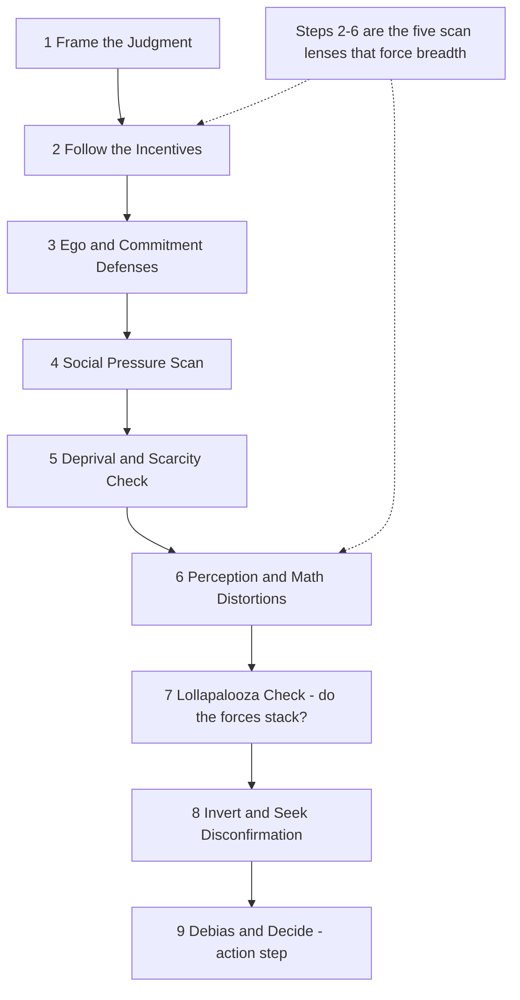

# Munger's "Psychology of Human Misjudgment" — Extraction Catalog

A row-by-row map from Charlie Munger's 1995 Harvard talk ("The Psychology of Human Misjudgment") to
the techniques, persona, and prompts of the Creative Thinking framework. It is the human-readable
companion to the `cognitive_bias_audit` technique, the `charlie_munger` persona, and the
`munger-checklist` / `invert-problem` prompts.

## Executive Summary

**What this maps.** Munger's talk enumerates the standard causes of human misjudgment — incentives,
denial, social proof, deprival, availability, and the rest — and three meta-moves that defeat them:
the **checklist**, **inversion**, and the **lollapalooza** (biases combine multiplicatively). This
catalog assigns each tendency its Munger antidote and the framework technique(s) that operationalize
that antidote, with `cognitive_bias_audit` step numbers in parentheses.

**How to use it.** The four artifacts compose into one workflow:

● **Persona `charlie_munger`** — bias your session toward checklist-and-inversion thinking. It
boosts `cognitive_bias_audit` (0.95) and injects Munger's voice into every step. Distinct from
`nassim_taleb`: Taleb owns _fragility/probability_ (`risk-aware`); Munger owns _cognition/decision
quality_ (`analytical`) and pointedly omits `anecdotal_signal` — the vivid anecdote is the enemy. ●
**Technique `cognitive_bias_audit`** — the 9-step misjudgment checklist (emoji 🪞). It is the engine
this whole catalog feeds. Steps 2–6 are five scan lenses that _force breadth_ so you cannot stop at
the first plausible cause; step 9 is the only `action` step (declaring a verdict re-arms commitment
bias). ● **Prompt `munger-checklist`** — run the full checklist on a concrete decision, then invert.
Wires in `persona: charlie_munger` + `cognitive_bias_audit`. ● **Prompt `invert-problem`** —
"invert, always invert": enumerate the failure modes to avoid, biased toward `reverse_benchmarking`.

**The shortest path:** call `munger-checklist` on a live decision → it discovers, plans, and
executes `cognitive_bias_audit` under the `charlie_munger` persona → use this catalog to read off
which tendencies each step is hunting and which secondary techniques to bring in.

## How to Read This Catalog

Five columns, one row per tendency:

● **#** — the tendency's index in this catalog. ● **Tendency (Munger's term)** — the cause of
misjudgment as Munger named it. ● **Munger's antidote** — the corrective discipline Munger
prescribes against it. ● **Mapped technique(s)** — the framework technique(s) that operationalize
the antidote. `cognitive_bias_audit` is the primary home for almost every tendency; the step that
targets it is in parentheses. Secondary techniques compose _around_ the audit (run the audit first,
then them). ● **Why it maps** — the link, anchored to one of Munger's own examples from the talk.

**A note on the count.** The 1995 talk names roughly two dozen tendencies (commonly cited as 24;
Munger later expanded the canon to 25 in _Poor Charlie's Almanack_). This catalog consolidates them
into the 22 entries below — for example, reward and punishment are one super-response, and
incentive-caused bias recurs as both a self-bias (#1) and an advisor-bias (#3). All 22 fold into the
9-step audit.

## The Catalog

| #   | Tendency (Munger's term)                                 | Munger's antidote                                                          | Mapped technique(s)                                                                 | Why it maps                                                                                                                                                                                    |
| --- | -------------------------------------------------------- | -------------------------------------------------------------------------- | ----------------------------------------------------------------------------------- | ---------------------------------------------------------------------------------------------------------------------------------------------------------------------------------------------- |
| 1   | Reward/Punishment Super-Response (incentive-caused bias) | Follow the incentives; apply a windage factor to any advisor who profits   | `cognitive_bias_audit` (step 2), `criteria_based_analysis`                          | FedEx fixed the night shift only by paying per shift, not per hour; Xerox salesmen pushed the worse machine on fat commissions — step 2 asks whose pay, ego, or status moves with each answer. |
| 2   | Simple Psychological Denial                              | Name the painful fact out loud                                             | `cognitive_bias_audit` (step 3)                                                     | The mother who insisted her dead pilot son was merely "lost at sea" — step 3 forces the painful truth you refuse to register.                                                                  |
| 3   | Incentive-Caused Bias in advisors (agency costs)         | Discount advice from those who profit from it                              | `cognitive_bias_audit` (step 2), `criteria_based_analysis`                          | The gall-bladder surgeon who removed healthy organs in perfect sincerity — the sincere-but-biased advisor is the dangerous one.                                                                |
| 4   | Consistency & Commitment Tendency                        | Treat conclusions as hypotheses; don't declare too early; run a pre-mortem | `cognitive_bias_audit` (steps 3, 8), `competing_hypotheses`, `reverse_benchmarking` | Max Planck's old guard never converted, they just died off; "public disclosure pounds it in" — so hold the verdict as a hypothesis and invert before committing.                               |
| 5   | Pavlovian Association                                    | Ask what really causes the correlation; mistrust mere association          | `cognitive_bias_audit` (step 6), `perception_optimization`                          | Three-quarters of advertising runs on pure association; Coke buys imagery, not argument — step 6 separates causation from a conditioned response.                                              |
| 6   | Reciprocation Tendency                                   | Beware unearned favors (Sam Walton's no-gifts-from-vendors rule)           | `cognitive_bias_audit` (step 4), `context_reframing`                                | Cialdini's ask-for-a-lot-then-retreat concession trick manufactures obligation — step 4's social scan flags the debt you never chose to incur.                                                 |
| 7   | Social Proof                                             | Run an independent checklist pass; ignore the crowd under stress           | `cognitive_bias_audit` (step 4), `competing_hypotheses`, `six_hats`                 | Kitty Genovese died as everyone read everyone else's inaction as proof of safety; oil companies bought fertilizer companies because rivals had.                                                |
| 8   | Math-Elegance / Man-with-a-Hammer                        | Add models; never force one tool onto every problem                        | `nine_windows`, `first_principles`, `cognitive_bias_audit` (whole checklist)        | Economists' love of efficient-market elegance; "better to be roughly right than precisely wrong" — to the man with one hammer every problem is a nail.                                         |
| 9   | Contrast-Caused Distortion                               | Check the absolute scale; watch for framing by comparison                  | `cognitive_bias_audit` (step 6), `context_reframing`, `perception_optimization`     | Three buckets of water fool the hand; the frog boils because the heat arrived in small contrasting steps.                                                                                      |
| 10  | Over-Influence by Authority                              | Demand the "why"; let the co-pilot speak                                   | `cognitive_bias_audit` (step 4), `competing_hypotheses`                             | Milgram's subjects shocked on command; roughly a quarter of airline crashes involve a deferential co-pilot who let a known error stand.                                                        |
| 11  | Deprival Super-Reaction (scarcity/loss)                  | Size the felt loss; refuse to escalate                                     | `cognitive_bias_audit` (step 5), `perception_optimization`, `context_reframing`     | Munger's own dog bit him over food taken away; New Coke; the neighbor's-tree feud — loss looms larger than the merits and reciprocated animosity escalates.                                    |
| 12  | Envy/Jealousy                                            | Name envy as the driver                                                    | `cognitive_bias_audit` (step 3)                                                     | "It is not greed but envy that drives the world" — step 3 names the motive no one will admit to.                                                                                               |
| 13  | Chemical Dependency                                      | Recognize the denial it always brings                                      | `cognitive_bias_audit` (step 3)                                                     | Addiction "always involves massive denial" — it couples to the same self-deception machinery step 3 already hunts.                                                                             |
| 14  | Mis-Gambling Compulsion                                  | Beware variable reinforcement and near-misses                              | `cognitive_bias_audit` (step 5)                                                     | Letting players pick their own lottery numbers lifts sales; slot machines are engineered for near-misses — the deprival/near-miss lens catches the hook.                                       |
| 15  | Liking/Disliking Distortion                              | Discount love of your own ideas; learn from the disliked                   | `cognitive_bias_audit` (step 3), `competing_hypotheses`                             | We over-like ourselves, our own kind, and our own conclusions, and bend the facts to fit the affection.                                                                                        |
| 16  | Availability-Misweighing (non-mathematical brain)        | Use base rates; think like Zeckhauser plays bridge                         | `cognitive_bias_audit` (step 6), `competing_hypotheses`, `criteria_based_analysis`  | Kahneman & Tversky; the See's embezzler base rate — weigh the reference class, not whatever springs most readily to mind.                                                                      |
| 17  | Over-Influence by Extra-Vivid Evidence                   | Down-weight the vivid; weight the base rate                                | `cognitive_bias_audit` (step 6), `anecdotal_signal`                                 | Munger's $30M mistake; Gutfreund who "looked into his eyes" and trusted the man — one vivid impression overrode the math.                                                                      |
| 18  | No-Theory / "Why?" Confusion                             | Hang facts on theory structures; always explain why (the five W's)         | `cognitive_bias_audit` (step 9), `first_principles`, `concept_extraction`           | Carl Braun mandated the five W's on every communication; "watch one, do one, teach one" — a fact not hung on a why-theory won't stick.                                                         |
| 19  | Other Sensation/Memory/Cognition Limits                  | Accept the limits; slow down                                               | `cognitive_bias_audit` (step 6)                                                     | "I don't have time for that" — acknowledge the brain's crude shortcuts instead of trusting them as truth.                                                                                      |
| 20  | Stress-Induced Mental Change                             | Recognize that acute stress distorts judgment                              | `cognitive_bias_audit` (step 4), `neural_state`                                     | Pavlov's dogs suffered permanent breakdowns in the Leningrad flood — manage the cognitive state before trusting a decision made under stress.                                                  |
| 21  | Decline / Loss of Ability through Disuse                 | Use simulators; keep skills fresh                                          | `meta_learning`, `neural_state` (partial — see gaps)                                | Pilots stay sharp on simulators — skills rot without rehearsal; no single dedicated technique owns this yet.                                                                                   |
| 22  | Say-Something Syndrome (organizational noise)            | Don't add noise; silence is acceptable                                     | `cognitive_bias_audit` (step 4)                                                     | The honeybee whose garbled find still makes it dance — people talk to fill space; step 4 separates signal from social noise.                                                                   |

## Cross-Cutting Methods

Munger's three meta-moves are not single tendencies; they are how the checklist defeats all of them.
Each maps to framework machinery:

● **The latticework of mental models** → `nine_windows`. Munger's antidote to the one-hammer trap is
a multidisciplinary grid; `nine_windows` is the framework's closest structural analog — it forces
the problem across system levels and time, the way a latticework forces it across disciplines. ●
**Inversion ("invert, always invert")** → `reverse_benchmarking` + the `invert-problem` prompt +
`cognitive_bias_audit` **step 8**. Darwin paid extra attention to the evidence that disconfirmed his
cherished ideas; step 8 makes you argue the opposite conclusion, `reverse_benchmarking` hunts the
vacant space rivals avoid, and the `invert-problem` prompt enumerates "everything that guarantees
failure" so you can refuse to do it. ● **The lollapalooza effect (4–5 tendencies converging)** →
`cognitive_bias_audit` **step 7**. The single most important move: tendencies do not add, they
multiply. Step 7 lists which forces from steps 2–6 stack toward the _same_ conclusion — Tupperware
parties, open-outcry auctions, a dysfunctional board are each several tendencies pulling one way at
once. ● **The checklist method** → the whole `cognitive_bias_audit` technique. "Mentally run down
the list instead of jumping on availability." The five scan lenses (steps 2–6) are the checklist
made structural — you cannot exit the technique having weighed only the one factor that came to mind
first.

## Coverage Gaps & [tbd] Markers

Two tendencies have **no single dedicated technique** and are flagged as future-technique
candidates:

● **#8 Math-Elegance / Man-with-a-Hammer** — [tbd] mapped across `nine_windows` +
`first_principles` + the whole audit, but none is a purpose-built _multi-model latticework_
technique. A dedicated `latticework` / `multi_model` technique (force the problem through N named
disciplinary lenses) would close this. Today it is a composition, not a technique. ● **#21 Decline /
Loss of Ability through Disuse** — [tbd] only partially served by `meta_learning`
(learning-to-learn) and `neural_state` (cognitive-state management). Neither targets _skill
maintenance through deliberate rehearsal_ (Munger's flight simulator). A `deliberate_practice` /
`skill_maintenance` technique is the clean future home.

Minor thin spots (mapped, but lightly): **#19 Other Cognition Limits** is a catch-all that lands
only on step 6, and **#13 Chemical Dependency** rides step 3's denial machinery rather than a lens
of its own. Both are intentional — the audit clusters, it does not enumerate one step per tendency.

## Cross-References

● **Full technique reference** — [`SPECIFICATIONS.md`](../SPECIFICATIONS.md). Every mapped technique
(`competing_hypotheses`, `reverse_benchmarking`, `nine_windows`, `criteria_based_analysis`, etc.) is
specified there in depth. ● **Persona definition** —
[`src/personas/catalog.ts`](../src/personas/catalog.ts). The `charlie_munger` entry sits immediately
after `nassim_taleb`; its top `techniqueBias` key is `cognitive_bias_audit` (0.95). ● **Technique
handler** —
[`src/techniques/CognitiveBiasAuditHandler.ts`](../src/techniques/CognitiveBiasAuditHandler.ts). The
9-step engine; the 24 tendencies are encoded once as an inline `TENDENCIES` const, and step 9
carries the `ReflexiveEffects` for committing to a verdict.

---

_Companion to the `cognitive_bias_audit` technique, the `charlie_munger` persona, and the
`munger-checklist` / `invert-problem` prompts. Source: Charlie Munger, "The Psychology of Human
Misjudgment," Harvard, June 1995._
